# gpu.c3l samples

Standalone consumers of [`gpu.c3l`](https://github.com/fesoliveira014/gpu.c3l),
vendored at [v0.5.0](https://github.com/fesoliveira014/gpu.c3l/releases/tag/v0.5.0)
as a pinned submodule. Samples live under `samples/`, numbered in order of
complexity from `01_minimal_triangle` to `26_cornell_box`; later samples assume
the concepts of earlier ones. Each sample owns its shaders and ABI schemas;
`scripts/build_shaders.py` runs the library's `gpu_shaders` tool over every
sample. Code shared between samples lives in `shared/`.

## Setup

```sh
git clone --recursive https://github.com/fesoliveira014/gpu.c3l-samples
cd gpu.c3l-samples
```

Requirements:

- `c3c` 0.8.3
- `glslc` from the Vulkan SDK or shaderc
- A Vulkan 1.3 loader and driver; lavapipe works for headless samples
- SDL3 and a window system for windowed samples

On Windows, build the VMA 3.3.0 static library using the pinned-header commands
in [`testing.md`](lib/gpu.c3l/docs/contributing/testing.md) under “Prerequisites on windows-x64”.
Run `python3 scripts/copy_runtime_deps.py` after building to place `SDL3.dll`
beside the executables.

## Device setup

Samples create their runtime, device, queue, command allocator, and optional
surface and swapchain through `gpu::util::DeviceContext`. The defaults select
full contract checks and a graphics queue; samples turn on Vulkan validation
layers, name the application, and override what they need:

```c3
util::DeviceContextDesc desc = util::default_device_context_desc();
desc.runtime.enable_vulkan_validation = true;
desc.runtime.application_name = "my_sample";
util::DeviceContext context = util::create_device_context(&desc)!;
defer util::destroy_device_context(&context);
```

Headless compute samples set `desc.device.queues.required = { .compute }` and
`desc.command_queue = gpu::QueueKind.COMPUTE`. Windowed samples pass
`sample_window::surface_factory` with the `SampleWindow` as user data and fill
`desc.swapchain` from the window's pixel size; the context then owns the
swapchain, and the sample waits `wait_swapchain_presentations` before teardown.

Windowed samples borrow `context.swapchain_info` for the selected format, extent,
image count and dormant state. Resize recovery writes its fresh query result
back through that borrowed pointer, keeping the context snapshot current.

Optional device features (`enable_mesh_shaders`, `enable_ray_tracing_pipelines`,
`unified_layouts`) are set on `desc.device`; a larger command allocator or a
second queue is requested through `desc.command_allocator` and extra
`create_command_allocator` calls. Adapter selection prefers discrete, then
integrated, then software devices among those that satisfy the description.

`present_mode_explorer` recreates swapchains per present mode, so it keeps the
manual runtime, adapter, device, and swapchain path from
`shared/sample_window_sdl.c3`. Allocations, upload reuse, readback, and
completion policy remain sample-local.

## Build and run

```sh
python3 scripts/build_shaders.py
c3c build root_pointer_compute
./build/root_pointer_compute
```

Windowed samples accept `--frames N` for an automatic smoke-test exit and
`--no-vsync` for MAILBOX presentation:

```sh
./build/hello_triangle_sdl --frames 30
```

Every windowed loop uses the shared finite two-millisecond image-acquisition
budget. `WAIT_TIMEOUT` skips the current frame and returns to SDL event
processing, which avoids both an unbounded WSI wait and a hot nonblocking retry
loop.

`minimal_triangle` is the exception to both rules. It takes no flags, waits for
each frame's completion, and acquires without a timeout. It also skips
validation layers and resize recovery. Close its window to exit.

## Smoke matrix

All GPU samples require Vulkan 1.3. Windowed samples also require SDL3 and
presentation support. Build with `c3c build <target>`, then run
`./build/<target> <smoke args>`; omit arguments shown as `—`. Create `out/`
before commands that request screenshots. A sample in `samples/NN_<target>`
builds as `<target>`, without the number. Each preview is a fixed-size
thumbnail, `screenshots/<name>_thumb.png`, linking to the full screenshot.

| # | Preview | Target | Type | Additional capability | Smoke args |
|---|---|---|---|---|---|
| — | — | `shared_selftest` | helper | none | — |
| — | — | `frame_upload_selftest` | helper | none | — |
| 01 | <a href="samples/01_minimal_triangle/screenshots/minimal_triangle.png">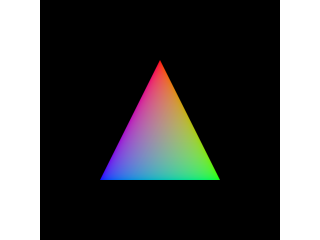</a> | [`minimal_triangle`](samples/01_minimal_triangle/) | windowed | smallest windowed program; no roots, no barriers, no descriptors, no flags | — |
| 02 | <a href="samples/02_hello_triangle_sdl/screenshots/hello_triangle_sdl.png">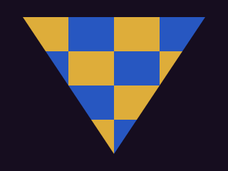</a> | [`hello_triangle_sdl`](samples/02_hello_triangle_sdl/) | windowed | baseline presentation; unified layouts, inline root payload | `--frames 30 --screenshot out/hello_triangle_sdl.png` |
| 03 | — | [`root_pointer_compute`](samples/03_root_pointer_compute/) | headless | compute, GPU-addressed spans | — |
| 04 | — | [`memory_report`](samples/04_memory_report/) | headless | memory-budget and independent-allocation reporting | — |
| 05 | — | [`bindless_texture_compute`](samples/05_bindless_texture_compute/) | headless | sampled and storage images | — |
| 06 | <a href="samples/06_image_processing/screenshots/image_processing.png">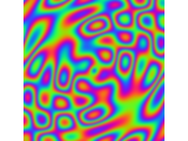</a> | [`image_processing`](samples/06_image_processing/) | headless | storage images, span atomics | `--screenshot out/image_processing.png` |
| 07 | <a href="samples/07_offscreen_triangle/screenshots/offscreen_triangle.png">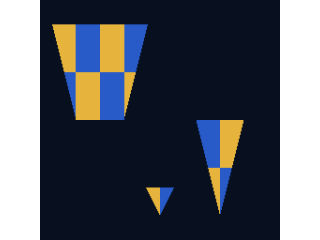</a> | [`offscreen_triangle`](samples/07_offscreen_triangle/) | headless | dynamic rendering, transfer readback | `--screenshot out/offscreen_triangle.png` |
| 08 | <a href="samples/08_textured_cube/screenshots/textured_cube.png">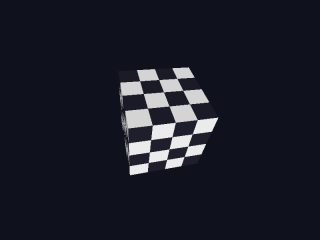</a> | [`textured_cube`](samples/08_textured_cube/) | windowed | depth attachment, sampled texture | `--frames 30 --screenshot out/textured_cube.png` |
| 09 | <a href="samples/09_texture_filtering/screenshots/texture_filtering.png">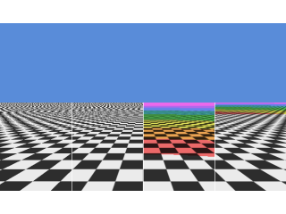</a> | [`texture_filtering`](samples/09_texture_filtering/) | windowed | mip sampling; anisotropy optional | `--frames 30 --screenshot out/texture_filtering.png` |
| 10 | <a href="samples/10_volume_texture/screenshots/volume_texture.png">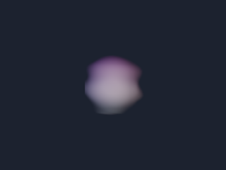</a> | [`volume_texture`](samples/10_volume_texture/) | windowed | 3D texture upload and sampled volume raymarch | `--frames 30 --screenshot out/volume_texture.png` |
| 11 | <a href="samples/11_skybox/screenshots/skybox.png">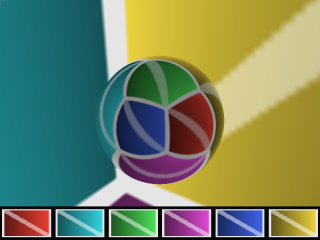</a> | [`skybox`](samples/11_skybox/) | windowed | cube-compatible texture, cube and per-face views | `--frames 30 --screenshot out/skybox.png` |
| 12 | <a href="samples/12_compressed_textures/screenshots/compressed_textures.png">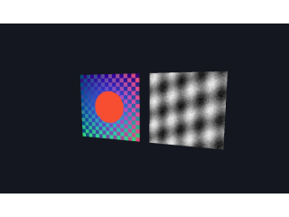</a> | [`compressed_textures`](samples/12_compressed_textures/) | windowed | BC1 and BC4 upload with full mip chains | `--frames 30 --screenshot out/compressed_textures.png` |
| 13 | <a href="samples/13_present_mode_explorer/screenshots/present_mode_explorer.png">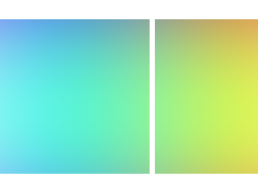</a> | [`present_mode_explorer`](samples/13_present_mode_explorer/) | windowed | FIFO; MAILBOX and IMMEDIATE optional | `--frames 30 --screenshot out/present_mode_explorer.png` |
| 14 | <a href="samples/14_pbr_materials/screenshots/pbr_materials.png">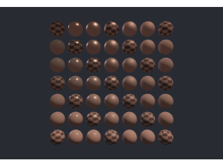</a> | [`pbr_materials`](samples/14_pbr_materials/) | windowed | instancing, sampled textures | `--frames 30 --screenshot out/pbr_materials.png` |
| 15 | <a href="samples/15_particle_sim/screenshots/particle_sim.png">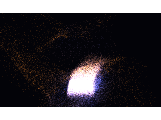</a> | [`particle_sim`](samples/15_particle_sim/) | windowed | compute; async compute queue optional | `--frames 30 --screenshot out/particle_sim.png` |
| 16 | <a href="samples/16_stencil_mask/screenshots/stencil_mask.png">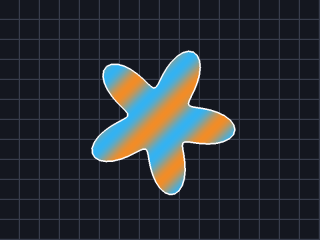</a> | [`stencil_mask`](samples/16_stencil_mask/) | windowed | stencil attachment state, stencil-aspect readback | `--frames 30 --screenshot out/stencil_mask.png` |
| 17 | <a href="samples/17_shadow_mapping/screenshots/shadow_mapping.png">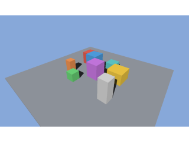</a> | [`shadow_mapping`](samples/17_shadow_mapping/) | windowed | depth compare sampling | `--frames 30 --screenshot out/shadow_mapping.png` |
| 18 | <a href="samples/18_deferred_shading/screenshots/deferred_shading.png">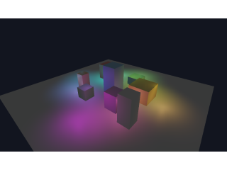</a> | [`deferred_shading`](samples/18_deferred_shading/) | windowed | three color attachments, RGBA16F | `--frames 30 --screenshot out/deferred_shading.png` |
| 19 | <a href="samples/19_frustum_culling/screenshots/frustum_culling.png">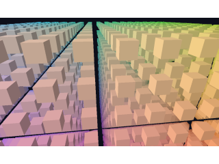</a> | [`frustum_culling`](samples/19_frustum_culling/) | windowed | indirect multi-draw | `--frames 30 --screenshot out/frustum_culling.png` |
| 20 | <a href="samples/20_gpu_driven_draw_sdl/screenshots/gpu_driven_draw_sdl.png"></a> | [`gpu_driven_draw_sdl`](samples/20_gpu_driven_draw_sdl/) | windowed | GPU-compacted generated roots/draws; shared-root indirect fallback | `--frames 30 --screenshot out/gpu_driven_draw_sdl.png` |
| 21 | <a href="samples/21_mesh_shading/screenshots/mesh_shading.png">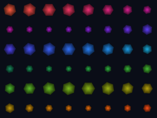</a> | [`mesh_shading`](samples/21_mesh_shading/) | windowed | task and mesh shader pipelines, direct and indirect mesh draws | `--frames 30 --screenshot out/mesh_shading.png` |
| 22 | — | [`texture_streaming`](samples/22_texture_streaming/) | headless | reserved texture-index ranges, in-place view updates | — |
| 23 | — | [`bindless_stress`](samples/23_bindless_stress/) | headless | 8,192 published texture views with churn | — |
| 24 | — | [`pipeline_cache_timing`](samples/24_pipeline_cache_timing/) | headless | graphics and compute pipeline caches | — |
| 25 | — | [`multithreaded_recording`](samples/25_multithreaded_recording/) | headless | host threads, one explicit allocator per worker | — |
| 26 | <a href="samples/26_cornell_box/screenshots/cornell_box.png">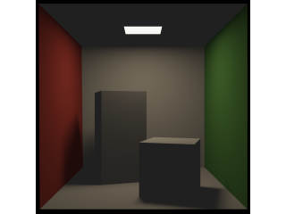</a> | [`cornell_box`](samples/26_cornell_box/) | windowed | direct ray-tracing pipelines, acceleration structures | `--validate --frames 1 --screenshot out/cornell_box.png` |

Each sample README describes its output and optional flags. CI runs this full
matrix on lavapipe; windowed targets use xvfb and the listed frame bound.
`minimal_triangle` has no frame bound, so CI stops it with SIGTERM after five
seconds; SDL turns the signal into a quit event and the sample exits zero.
