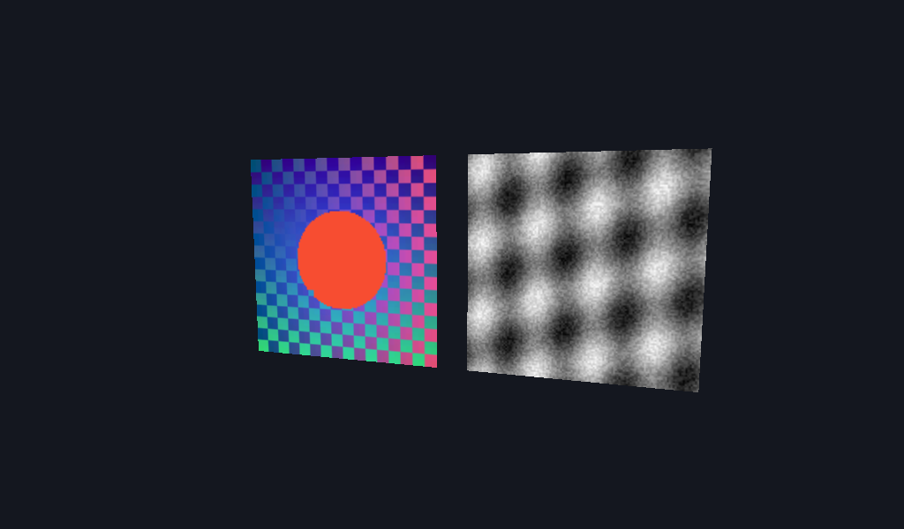

# compressed_textures



Encodes two procedural images to BC1 and BC4 on the CPU, uploads the full
mip chains, and draws them on two tilting quads through a trilinear sampler.

It demonstrates:

- `supports_texture_desc` probing for BC1, BC3, BC4, BC5, BC6H, and BC7.
- A minimal in-sample BC1 (RGB565 endpoints, 2-bit indices) and BC4 (byte
  endpoints, 3-bit indices) block encoder; no external assets.
- `texture_mip_bytes` and `texture_mip_dimension` sizing a block-compressed
  chain down to 1x1, one `cmd_copy_buffer_to_texture` per mip from one
  staging allocation.
- A `mat4` root field from the schema generator.

Startup prints the per-format support table and the staged byte totals
against the RGBA8 equivalent. Use `--frames N` for automatic exit and
`--no-vsync` to request MAILBOX.

```sh
c3c run compressed_textures -- --frames 30 --screenshot out/compressed_textures.png
```
