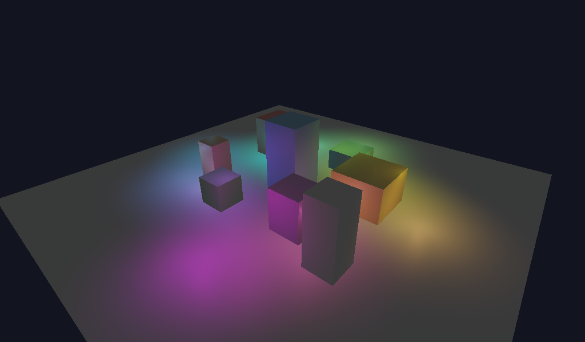

# deferred_shading

Classic two-pass deferred renderer: geometry rasterizes once into a
multi-target G-buffer, then a fullscreen resolve pass shades every pixel with
16 animated point lights. The geometry pass uses multiple color attachments.



## G-buffer

```
geometry pass (MRT)                       resolve pass
┌───────────────────────────┐            ┌──────────────────────────┐
│ location 0 → albedo  RGBA8│──sampled──▶│ fullscreen triangle      │
│ location 1 → normal  16F  │──sampled──▶│ for each light:          │
│ location 2 → position 16F │──sampled──▶│   lambert · attenuation² │
│ depth      → D32          │            │ → swapchain              │
└───────────────────────────┘            └──────────────────────────┘
```

- All three color targets are `{ color_attach, sampled }` and recreated on
  resize alongside the depth target.
- One `RenderPassDesc` carries all three `ColorTargetDesc`s; the pipeline
  declares matching `color_formats`, and the fragment shader writes
  `location 0..2`.
- World-space normal and position are stored raw in `RGBA16_FLOAT`; the
  position target's `w = 1` doubles as the coverage flag the resolve uses to
  paint sky pixels.

## Resolve

- Fullscreen triangle from `gl_VertexIndex` — no vertex buffer.
- G-buffer targets are read through the descriptor heap (`TextureIndex` per
  target + one `NEAREST` sampler in the root), so the resolve is plain
  root-pointer plumbing like any other pass.
- Lights are written into the frame arena each frame (frame N-1 may still be
  reading its copy on the GPU) and addressed from the root (`lights_gpu` +
  `light_count`). Shading is
  `ambient + Σ (albedo · lambert + blinn_phong) · light_color · atten²`,
  then Reinhard tonemap and a gamma encode — the swapchain is UNORM, not
  sRGB, so linear light written raw would display crushed-dark.

## Barriers

The three targets round-trip `COLOR_ATTACHMENT → SHADER_READ` inside the
frame and back at the top of the next one, same tracked-layout pattern as the
shadow map in `shadow_mapping`.

## Run

```
c3c build deferred_shading
./build/deferred_shading [--frames N] [--no-vsync] [--screenshot out.png]
```
