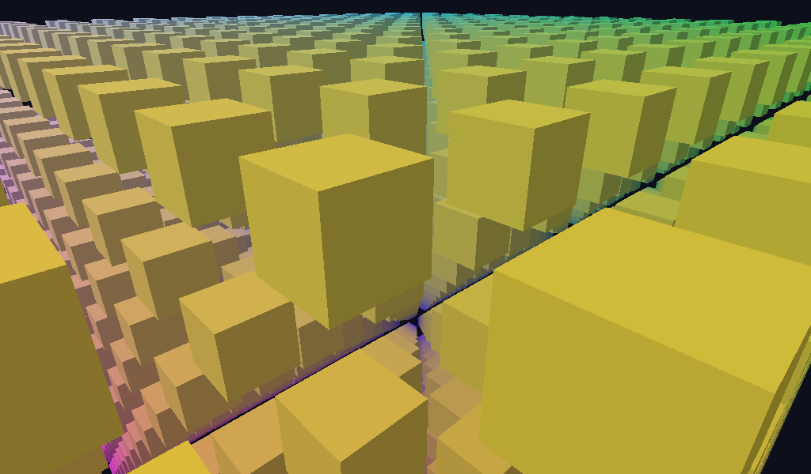

# frustum_culling



GPU frustum culling feeding indirect draws — the 3D graduation of
`gpu_driven_draw_sdl`'s slot-per-instance pattern.

```
CPU: orbit camera ─▶ view_proj ─▶ Gribb-Hartmann planes ─▶ CullRoot
GPU: cull.comp ── sphere vs 6 planes ──▶ args[id] = DrawIndirectCommand(36, 0|1, 0, id)
                                    └──▶ atomicAdd(stats.visible)
     barrier (SHADER_WRITE → INDIRECT_READ) ─▶ one cmd_draw_indirect multi-draw
```

What it demonstrates:

- **Camera-driven culling** — 4,096 cubes on a 16³ grid, bounding spheres
  tested against six frustum planes extracted on the CPU each frame and
  passed as `vec4`s in the cull root. Culled slots draw zero instances;
  `gl_DrawID` indexes the shared instance table (shaderDrawParameters).
- **Observable and self-verified** — a visible-count statistic is
  `atomicAdd`ed by the cull pass and read back every 30th frame
  (`visible N / 4096` on stdout); the run fails unless the count varied
  with the orbit and stayed within bounds.
- **Depth-tested field** — `D32_FLOAT`, LESS; per-face lambert × grid-space
  color gradient.

```sh
c3c run frustum_culling -- --frames 120 --screenshot culling.png
```
