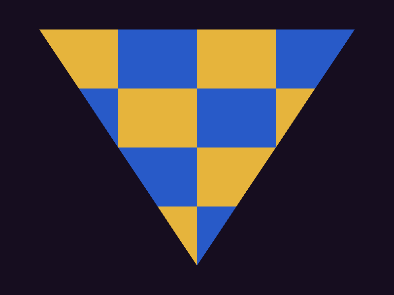

# hello_triangle_sdl



The offscreen triangle, presented: SDL3 window, platform-neutral surface,
swapchain with fault-driven resize.

Flow per frame:

1. Pump SDL events — quit exits, resize calls `resize_swapchain` with the new
   pixel size.
2. `acquire_next_image`; on `SWAPCHAIN_OUT_OF_DATE` resize and skip the frame
   (minimized windows stay dormant without recreate storms).
3. Barrier the acquired image to `COLOR_ATTACHMENT` (from `UNDEFINED` on first
   use, `PRESENT` after), render the textured triangle, barrier to `PRESENT`.
4. `submit` with `.swapchain` set — the backend waits the acquire semaphore
   and signals the image's present semaphore internally.
5. `present`; `SWAPCHAIN_OUT_OF_DATE` here also triggers a resize.

The core library never sees SDL: `samples/shared/sample_window_sdl.c3` extracts
native handles from SDL3 window properties (Wayland/X11/Win32) into the
platform-neutral `SurfaceDesc`.

Flags: `--frames N` renders N frames then exits (validation smoke);
`--no-vsync` requests MAILBOX (falls back to FIFO when unsupported).

Build and run from the repository root:

```sh
python3 scripts/build_shaders.py
mkdir -p out
c3c run hello_triangle_sdl -- --frames 30 --screenshot out/hello_triangle_sdl.png
```
