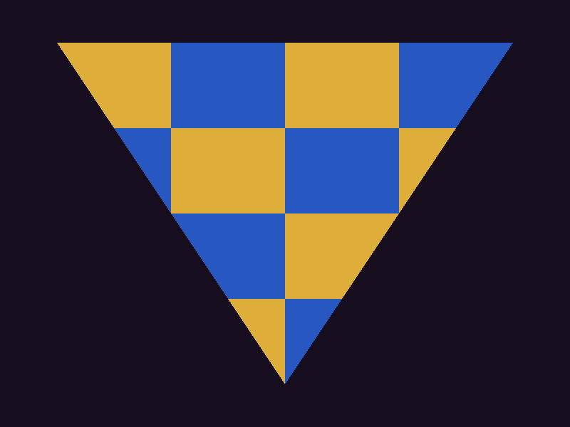

# hello_triangle_sdl



Presents a textured triangle through an SDL3 window and a GPU surface in the
fewest lines the library allows.

It demonstrates:

- `gpu::util::DeviceContext` setup through `sample_window::surface_factory`;
  the context owns the swapchain and the sample waits its presentations before
  teardown.

- `DeviceDesc.unified_layouts`: no application layout transitions. The only
  texture barrier orders the checker upload before fragment sampling; the
  swapchain image needs none. Startup prints `unified_layouts_optimal`.
- Inline root payload: `push graphics TriangleRoot` in `abi/triangle.abi`
  travels in the draw's push block through `@inline_root`; no root records,
  no per-frame upload ring, no vertex buffer (positions come from
  `gl_VertexIndex`).
- `allocate_mapped_memory` for the checker staging: one call returns the
  span, the mapping, and the address.
- `RenderPassDesc` with zero extent: the render area comes from the
  attachment.
- Resize recovery and dormant minimized-window handling.

Under unified layouts the swapchain image sits in the present layout between
submits, so `--screenshot` records its readback inside the frame's own command
list with `sample_capture::record_capture` and finishes it after submit.

Use `--frames N` for automatic exit and `--no-vsync` to request MAILBOX.

```sh
c3c run hello_triangle_sdl -- --frames 30 --screenshot out/hello_triangle_sdl.png
```
