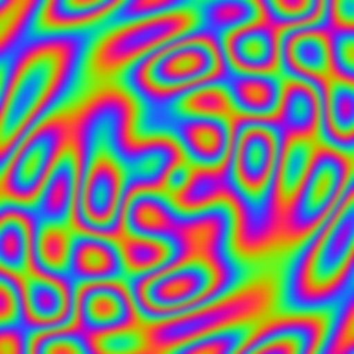

# image_processing



A headless compute chain showing how techniques compose: procedural
generation → separable gaussian blur → luminance histogram → readback
verification, all over root-addressed storage images.

```
generate.comp ─▶ A ─▶ blur.comp (H) ─▶ B ─▶ blur.comp (V) ─▶ A ─▶ histogram.comp ─▶ bins SSBO ─▶ readback
```

What it demonstrates:

- **Compute→compute chaining** — four dispatches in one command list with
  explicit storage write→read barriers between stages; images stay in
  `GENERAL` layout throughout.
- **Workgroup shared memory** — the blur loads each 64-texel strip plus a
  ±8 halo into `shared` memory cooperatively, `barrier()`s, then convolves
  from the strip. One shader serves both directions: a `horizontal` flag in
  the root swaps the indexing (root-driven configuration).
- **Atomics** — the histogram `atomicAdd`s into a 256-bin storage buffer
  addressed straight from the root.
- **Self-verification** — readback prints an ASCII histogram and asserts
  the bin sum equals the pixel count; a mismatch fails the run.

```sh
c3c run image_processing -- --screenshot blurred.png
```
