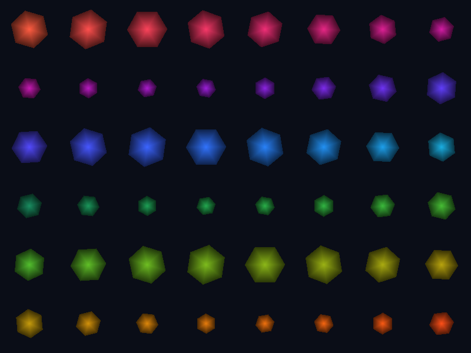

# mesh_shading



Windowed mesh shading: a task shader fans each work group out into up to four
mesh work groups, and each mesh work group emits one procedural hexagon with
per-meshlet color and animation. The 48-meshlet grid is drawn twice per frame:
the top half through `cmd_draw_mesh_tasks`, the bottom half through
`cmd_draw_mesh_tasks_indirect` with a CPU-written
`DrawMeshTasksIndirectCommand` in `CPU_WRITE_GPU_LOCAL` memory.

It demonstrates:

- `DeviceDesc.enable_mesh_shaders` and the `DeviceCaps.mesh_shaders` limits.
- `MeshPipelineDesc` with task, mesh, and fragment stages; mesh pipelines take
  the graphics root push, so `vertex_root_gpu` carries the mesh root.
- Direct and indirect mesh dispatch inside one render pass.
- `allocate_mapped_memory` for the indirect record and `AllocationInfo.device_local`
  reporting.

Build and run from the repository root:

```sh
python3 scripts/build_shaders.py
mkdir -p out
c3c run mesh_shading -- --frames 30 --screenshot out/mesh_shading.png
```

`--no-vsync` requests MAILBOX. Startup prints the mesh-shader limits and
whether the indirect record landed in device-local memory.
