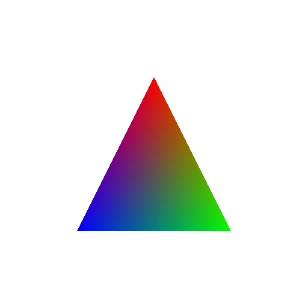

# minimal_triangle



The smallest windowed program: a vertex-colored triangle on an sRGB swapchain,
mirroring the `triangle` example from
[NoGraphicsAPI](https://github.com/sebbbi/NoGraphicsAPI/tree/main/examples/triangle).

It demonstrates:

- `gpu::util::create_device_context`: one call owns the runtime, adapter,
  device, queue, command allocator, surface, and sRGB swapchain.
- `unified_layouts`, so no barrier is recorded anywhere.
- A pipeline whose shaders take no root data: positions and colors come from
  `gl_VertexIndex`, and the draw passes zero roots.
- One command list per frame: clear, draw, submit against the acquire
  readiness point, wait for completion, present.
- No shader ABI schema, no allocations, no descriptors.

To stay minimal, the sample takes no flags and panics on any fault. It creates
a 512×512 swapchain once and does not recover from resize or minimize. It waits
for each frame's completion and acquires without a timeout instead of using the
shared two-millisecond budget. Close the window to exit.

```sh
c3c run minimal_triangle
```
