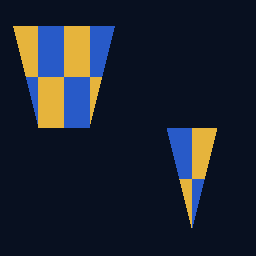

# offscreen_triangle



Headless rasterization proof: textured triangles rendered into two clipped
subregions without a window or swapchain, with optional PNG capture.

Flow:

1. Upload a checkerboard texture (staging → `TRANSFER_DST` → `SHADER_READ`).
2. Transition a `color_attach|transfer_src` render target to `COLOR_ATTACHMENT`.
3. One dynamic-rendering pass: clear, then two `cmd_draw` calls with distinct
   dynamic viewports and hardware scissors. The built-in readback checks that
   both clipped regions rendered and that the opposite quadrants stayed clear.
   The vertex shader
   pulls positions/UVs through `vertex_root` (no vertex buffers); the fragment
   shader samples the checkerboard through `TextureIndex`/`SamplerIndex` in
   `fragment_root` — the descriptor heap, from a graphics stage.
4. Read back and verify the clipped footprint; `--screenshot <path>` optionally
   writes the result as PNG.

Build and run from the repository root:

```sh
python scripts/build_shaders.py
c3c run offscreen_triangle -- --screenshot offscreen_triangle.png
```
