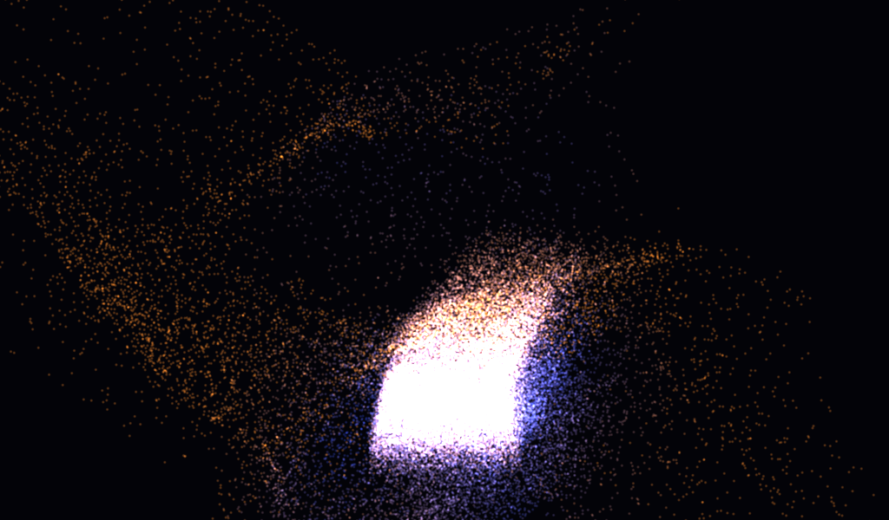

# particle_sim



65,536 particles integrated on the GPU and rendered as additive billboards.

It demonstrates:

- Two allocations whose span addresses are ping-ponged through roots.
- Separate compute and graphics submissions ordered by a completion point.
- Graphics and compute queue access declared on both allocations.
- Order-independent additive blending and instanced billboard rendering.

```sh
c3c run particle_sim -- --frames 300 --screenshot particles.png
```
