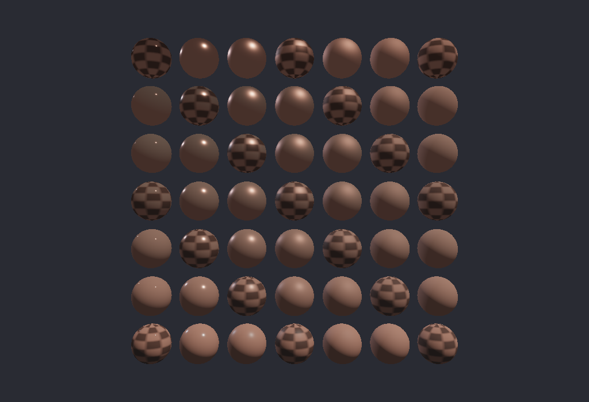

# pbr_materials



A 7x7 sphere grid rendered in one instanced draw. Roughness varies by column
and metallic response varies by row.

It demonstrates:

- Generated `MaterialIndex`, `SphereInstance`, and `Material` ABI types.
- Root-addressed instance and material tables in `CPU_WRITE` allocations.
- Per-material bindless `TextureIndex` selection.
- Cook-Torrance shading and a CPU-generated non-indexed sphere mesh.

```sh
c3c build pbr_materials
./build/pbr_materials [--frames N] [--no-vsync] [--screenshot out.png]
```
