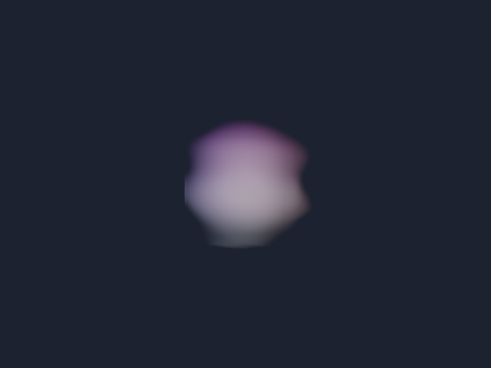

# volume_texture



A windowed fullscreen raymarch through a CPU-generated 3D nebula texture.

It demonstrates:

- Exact 3D texture and linear-filter capability checks.
- A caller-owned dedicated texture allocation and full-volume buffer upload.
- Bindless `sample_texture_3d` access from a fragment shader.
- Deterministic frame-derived animation and final-frame screenshot capture.

Unsupported 3D RGBA8 sampling prints `SKIP` and exits successfully. Other
failures remain errors.

```sh
c3c run volume_texture -- --frames 30 --screenshot volume_texture.png
```
