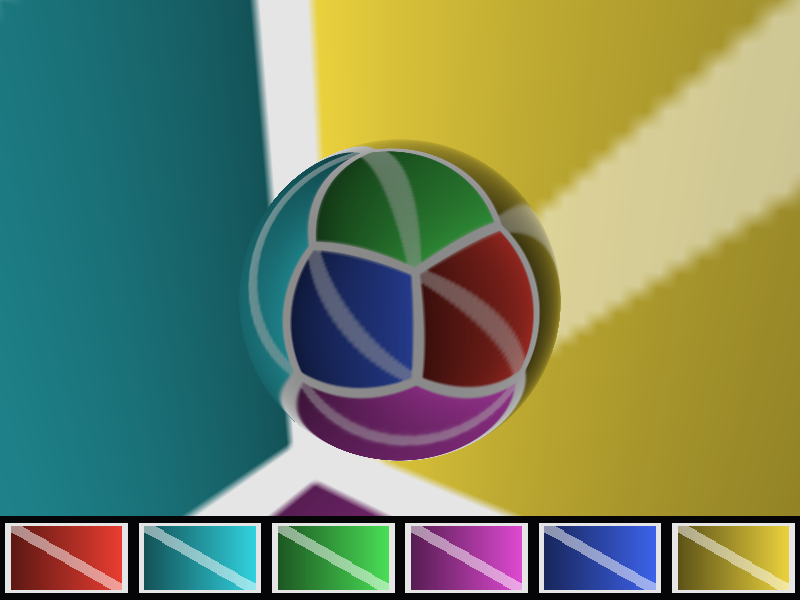

# skybox



An orbiting camera inside a procedurally generated cube map, with a mirror
sphere in the middle and a strip of the six faces along the bottom.

It demonstrates:

- A `cube_compatible` six-layer texture with three authored mip levels.
- One `cmd_copy_buffer_to_texture` per mip with `layer_count = 6`, faces
  packed back to back in +X, -X, +Y, -Y, +Z, -Z order.
- A cube view (`TextureViewDesc { .cube = true }`) sampled by direction with
  `sample_texture_cube_implicit` for the sky and `sample_texture_cube_lod`
  for the sphere, where roughness selects the mip.
- Six per-face 2D views of the same texture (`base_layer = f`,
  `layer_count = 1`) sampled through `sample_texture_2d_implicit` in the HUD.
- A full-screen triangle with the ray direction rebuilt from the camera
  basis in the root record, so no vertex data or depth attachment is needed.

Run with `--frames N` for automatic exit and `--screenshot <path>` to capture
the final frame:

```sh
c3c run skybox -- --frames 30 --screenshot out/skybox.png
```
