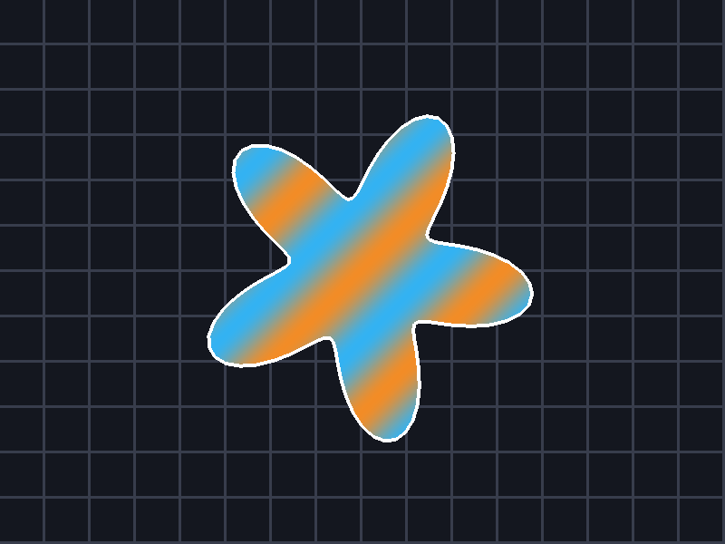

# stencil_mask



Masks a full-screen fill with a rotating star written to the stencil plane,
then reads the stencil aspect back on the host and in a shader.

It demonstrates:

- A combined depth-stencil attachment in `DeviceCaps.depth_stencil_format`
  with separate depth and stencil load/store ops and clear values.
- `GraphicsState.stencil` built from `stencil_face`: `ALWAYS`/`REPLACE` writes
  the mask id with color writes disabled, then `EQUAL` and `NOT_EQUAL` faces
  select the inside and outside fills within the same render pass.
- A stencil-aspect sampled view (`TextureViewDesc.aspect = STENCIL`) read
  through `gpu_fetch_uint` in a second pass to draw the white outline.
- Stencil readback with `cmd_copy_texture_to_buffer` on the `STENCIL` aspect,
  sized by `texture_mip_aspect_bytes`; the sample counts masked texels and
  fails when coverage falls outside the expected range.

Run with `--frames N` for automatic exit and `--screenshot <path>` to capture
the final frame:

```sh
c3c run stencil_mask -- --frames 30 --screenshot out/stencil_mask.png
```
