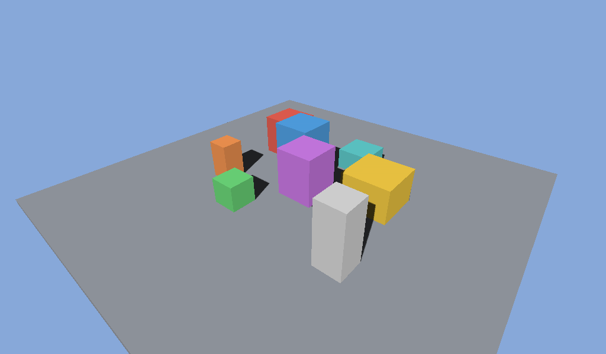

# shadow_mapping



The classic two-pass technique, driving the library's shadow features
end to end: an orbiting directional light renders a depth-only pass into a
2048² map, and the camera pass samples it with hardware depth compare.

```
pass 1 (light): depth-only render pass (no color attachments) → shadow map
                front-face culling + slope bias 1.0
barrier: DEPTH_STENCIL/DEPTH_WRITE → FRAGMENT_SHADER/SHADER_READ
pass 2 (camera): fragment transforms world → light clip, 3×3 PCF via
                 sample_shadow_2d (compare-enabled sampler, LESS)
```

What it demonstrates:

- **Depth-only passes** — `RenderPassDesc` with an empty color list and a
  pass-through fragment shader.
- **Hardware-compare sampling** — `SamplerDesc.compare_enable` +
  `sample_shadow_2d` through the aliased shadow heap view; nine PCF taps
  average the comparison results for soft edges.
- **Acne vs peter-panning** — the shadow pass culls FRONT faces (back faces
  carry the depth, which biases contact points naturally) plus a small slope
  bias via `RasterState.depth_bias_slope`. Constant-bias-only variants either
  show acne (too low) or detach shadows from the mesh bases (too high) —
  this combination keeps contact shadows grounded.
- **Cross-pass texture lifecycle** — the shadow map round-trips
  `DEPTH_STENCIL ↔ SHADER_READ` every frame under explicit barriers.

```sh
c3c run shadow_mapping -- --frames 120 --screenshot shadows.png
```
