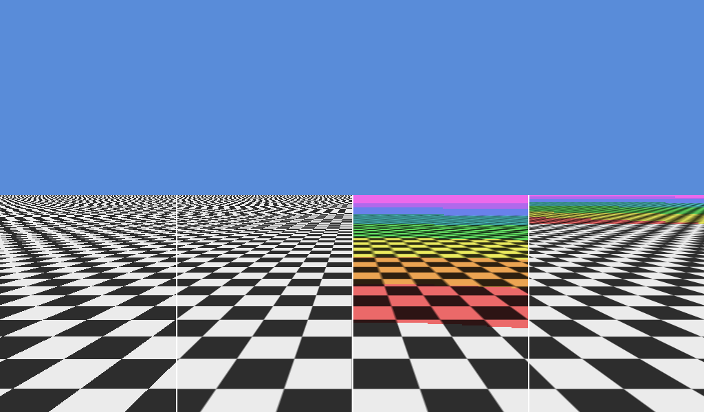

# texture_filtering



Compares four sampler configurations on a receding textured plane.

It demonstrates:

- A CPU-generated, per-level-tinted mip chain uploaded one level at a time.
- Bindless sampler selection through four `SamplerIndex` values.
- Nearest, bilinear, trilinear, and anisotropic filtering.
- Capability-gated anisotropy with a trilinear fallback.

```sh
c3c run texture_filtering -- --frames 30 --screenshot filtering.png
```
