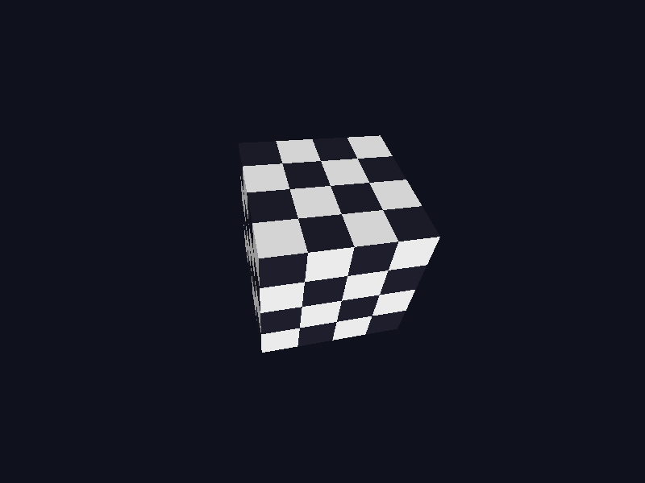

# textured_cube



A depth-tested rotating cube using root data and the descriptor heap.

It demonstrates:

- A frame-arena `SceneRoot` for matrices, descriptor indices, and geometry.
- Vertex data in a `CPU_WRITE` allocation addressed through its `GpuSpan`.
- Bindless texture and sampler indices shared by both shader stages.
- A resize-aware `D32_FLOAT` depth attachment with `LESS` testing.

Run with `--frames N` for automatic exit and `--screenshot <path>` to capture
the final frame:

```sh
c3c run textured_cube -- --frames 120 --screenshot cube.png
```
